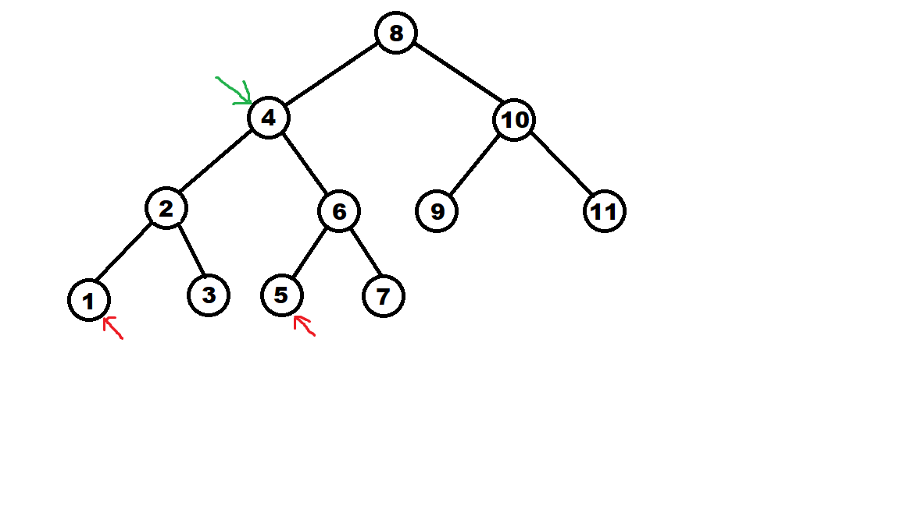

# Nearest Ancestor

In this problem you are given a tree and two nodes in the tree, and you want to find the node in the tree that is furthest from the root node and an ancestor of both nodes.

## Input Format

The input starts with three integers:

* **n**, the number of nodes in the tree.
* **i** and **j**, the target nodes.

The next line of input consists of **n** integers representing the tree.

## Output Format

The output should be one integer, the value of the node in the tree which is an ancestor of both nodes.

## Constraints

* 1 <= **n** <= 100.
* **i** and **j** are in the tree.

## Sample Input
<pre>
11 1 5  
8 4 12 2 6 10 13 1 3 5 7 9 11
</pre>

## Sample Output
<pre>
4
</pre>

