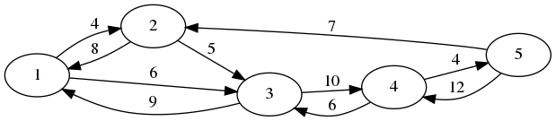

# Satellite Schedule

You are a programmer working on a solar system probe network. It is able to communicate large chunks of scientific data over vast distances, but is limited by the relative movement of the planets. The orbital mechanics team has calculated a schedule of how much data the involved satellites will be able to communicate with each other per week, over the course of the next mission cycle. You have been tasked with calculating how much total data the network could ship from the outer reaches to Earth over the course of the mission cycle, given the connectivity schedule.

Because of speed-of-light delay, satellite-to-satellite links are not necessarily symmetric. Satellites can be considered to have unlimited storage capacity. Data transmission is discrete: if a satellite receives data during one week of the mission, it cannot relay it until the next week.

## Input Format

The first line contains two integers:

* __*N*__, the number of communication nodes in the network.
* __*M*__, the number of weeks in the mission cycle.

The next N lines contain N integers each and form a grid __*G*__. Each entry at line *i*, column *j* represents the number of terabytes of data that can be transferred peer week from satellite *i* to satellite *j*.

## Constraints 

* 1 <= __*M*__ <= 20
* 2 <= __*N*__ <= 20
* 0 <= __*G[i][j]*__ <= 1000

## Output Format

Print the total number of terabytes which can be transferred from the last node (N) at the beginning of the mission cycle to the first node (1) at the end of the mission cycle, utilizing as much available capacity as possible.

## Sample Input
<pre>
5 5
0 4 6 0 0
8 0 5 0 0
9 0 0 10 0
0 3 6 0 4
0 7 0 12 0
</pre>

## Sample Output
<pre>
53
</pre>
